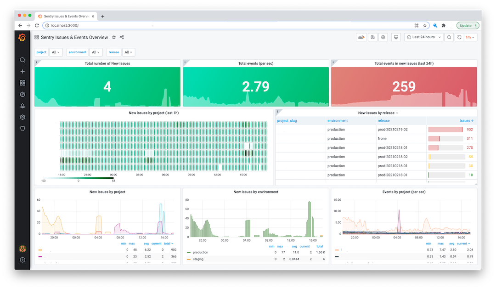

# Welcome to Sentry Prometheus Exporter 👋
[](https://github.com/italux/sentry-prometheus-exporter/blob/master/LICENSE)


> Export sentry project's metrics consistent with the Prometheus exposition formats

  * [Getting Started](#getting-started)
    + [Prerequisites](#prerequisites)
    + [Install](#install)
    + [Run](#run)
    + [Docker](#docker)
    + [Samples](#samples)
  * [Important Notes](#important-notes)
    + [Limitations](#limitations)
    + [Sentry API retry calls](#sentry-api-retry-calls)
    + [Recomendations & Tips](#recomendations--tips)
  * [Documentation](#-documentation)
  * [Contributing](#-contributing)
  * [License](#-license)
  * [Show your support](#show-your-support)
  * [Author](#author)

## Getting Started

### Prerequisites

- python >= 3.7.9
- Sentry API [auth token](https://docs.sentry.io/api/auth/#auth-tokens)
    > Authentication token permissions: `project:read` `org:read` `project:releases` `event:read`

### Install
```sh
pip install -r requirements.txt
```

### Run
```sh
export SENTRY_BASE_URL="https://sentry.io/api/0/"
export SENTRY_AUTH_TOKEN="[REPLACE_TOKEN]"
export SENTRY_EXPORTER_ORG="[ORGANIZATION_SLUG]"
```
```sh
python exporter.py
```

### Docker
**Run**
```sh
docker run --name sentry-exporter -e SENTRY_AUTH_TOKEN=[REPLACE_TOKEN] -e SENTRY_EXPORTER_ORG=[ORGANIZATION_SLUG] italux/sentry-prometheus-exporter
```
**Build local image**
```sh
docker-compose build
```
**Create a `.env` file**
```sh
echo SENTRY_BASE_URL="https://sentry.io/api/0/"
echo SENTRY_AUTH_TOKEN="[REPLACE_TOKEN]"
echo SENTRY_EXPORTER_ORG="[organization_slug]"
```
**Start containers**
```sh
docker-compose up -d
```

## Metrics

- `sentry_open_issue_events`: A Number of open issues (aka is:unresolved) per project in the past 1h
- `sentry_issues`: Gauge Histogram of open issues split into 3 buckets: 1h, 24h, and 14d
- `sentry_events`: Total events counts per project
- `sentry_rate_limit_second`: Rate limit of errors per second accepted for a project.

### Metric Configuration
By default all metrics are scraped, however, issue, event-related or rate-limit metrics can be disabled by setting the relevant variable to False:
```sh
export SENTRY_SCRAPE_ISSUE_METRICS=False
export SENTRY_SCRAPE_EVENT_METRICS=False
export SENTRY_SCRAPE_RATE_LIMIT_METRICS=False
```
By default, if `SENTRY_SCRAPE_ISSUE_METRICS=True or is unset` issue metrics are scraped for `1hour`, `24hours` and `14days`. Any of these can be disabled by setting the relevant variable to False:
```sh
export SENTRY_ISSUES_1H=False
export SENTRY_ISSUES_24H=False
export SENTRY_ISSUES_14D=False
```
As with `SENTRY_AUTH_TOKEN`, all of these variables can be passed in through the `docker run -e VAR_NAME=<>` command or via the `.env` file if using Docker Compose.

## Samples

**Grafana Dashboard**
[Sentry Issues & Events Overview](https://grafana.com/grafana/dashboards/13941)


**Prometheus configuration**: [`prometheus.yml`](samples/prometheus.yml)
```yaml
scrape_configs:
  - job_name: 'sentry_exporter'
    static_configs:
    - targets: ['sentry-exporter:9790']
    scrape_interval: 5m
    scrape_timeout: 4m
```

## ℹ️ Important Notes

### Limitations
- **Performance**: The exporter is serial, if your organization has a high number of issues & events you may experience `Context Deadline Exceeded` error during a Prometheus scrape

### Sentry API retry calls

The Sentry API limits the rate of requests to 3 per second, so the exporter retries on an HTTP exception.

You can tweak retry settings with environment variables, though default settings should work:

|  Environment variable    | Value type | Default value |                         Purpose                         |
|:------------------------:|:----------:|:-------------:|:-------------------------------------------------------:|
| `SENTRY_RETRY_TRIES`     | Integer    | 3             | How many retries should be made in case of an exception |
| `SENTRY_RETRY_DELAY`     | Float      | 1             | How many seconds to wait between retries                |
| `SENTRY_RETRY_MAX_DELAY` | Float      | 10            | Max delay to wait between retries                       |
| `SENTRY_RETRY_BACKOFF`   | Float      | 2             | Multiplier applied to delay between attempts            |
| `SENTRY_RETRY_JITTER`    | Float      | 0.5           | Extra seconds added to delay between attempts           |

### Recomendations & Tips
- Use `scrape_interval: 5m` minimum.
> This value will be defined by the number of new issues and events\
> higher number of events will take more time
- Use a high `scrape_timeout` for the exporter job
> General recomendation is to set `scrape_interval - 1` (i.e.: `4m`)

- If the scraping of particular metrics are disabled the values above can be reduced depending on your setup.

## 📒 Documentation

[Sentry Prometheus Exporter documentation](https://italux.github.io/sentry-prometheus-exporter/)

## 🤝 Contributing

Contributions, issues and feature requests are welcome!

- Feel free to check [issues page](https://github.com/italux/sentry-prometheus-exporter/issues).


## 📝 License

Copyright © 2021 [Italo Santos](https://github.com/italux).

This project is [GNU General Public License v2.0](https://github.com/italux/sentry-prometheus-exporter/blob/master/LICENSE) licensed.

## Show your support

Give a ⭐️ if this project helped you!

## Author

👤 **Italo Santos**

* Website: http://italosantos.com.br
* Twitter: [@italux](https://twitter.com/italux)
* Github: [@italux](https://github.com/italux)
* LinkedIn: [@italosantos](https://linkedin.com/in/italosantos)

***
_This README was generated with by [readme-md-generator](https://github.com/kefranabg/readme-md-generator)_
